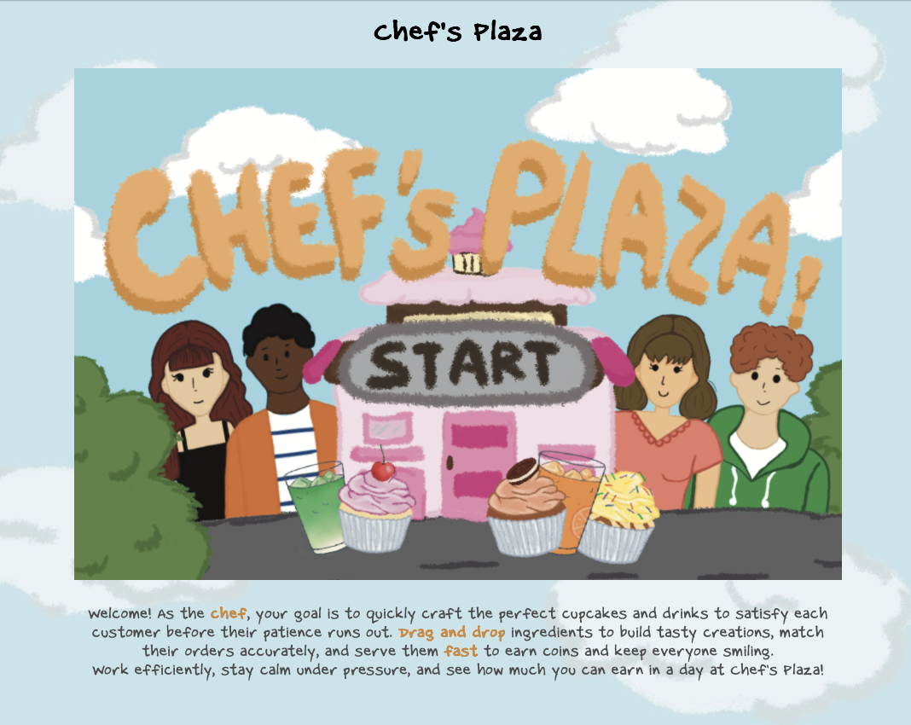

# 🧁 Cooking Game

Cooking and time-management game built with p5.js. Take orders from customers, make cupcakes and drinks, and try to keep your customers happy.

**[ Click to play. ](https://yanbmia.github.io/cooking-p5/)**



## About

This is an interactive cooking simulation game where you:
- Take customer orders
- Prepare cupcakes with different bases, frostings, and toppings
- Make various drinks (coffee, matcha, orange juice, smoothies)
- Manage customer patience levels
- Earn coins for correct orders

## How to Play

1. Click the **Start** button to begin
2. Read the customer's order in their speech bubble
3. Select and prepare the correct items
4. Serve the order before the customer's patience runs out
5. Earn coins for correct orders!


## Running Locally

1. Clone this repository:
   ```bash
   git clone https://github.com/yanbmia/cooking-p5.git
   ```

2. Open `index.html` in your web browser

   Or use a local server:
   ```bash
   python -m http.server 8000
   ```
   Then visit `http://localhost:8000`

## Credits

Game assets include custom graphics and sound effects for an immersive cooking experience. This was a group assignment made for a undergrad course.

